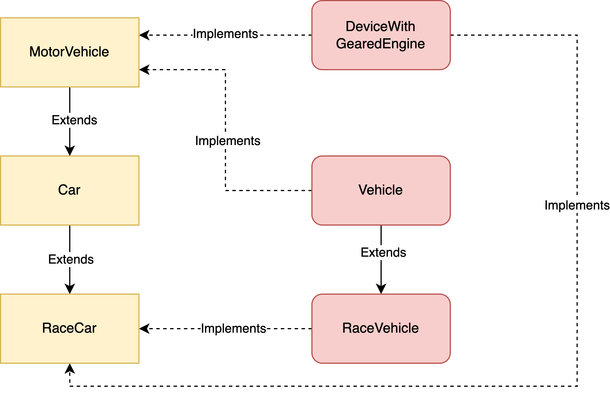

# Interfaces


- You `extend` classes
- You `implement` interfaces. You can't instantiate objects of an interface.
- Interface: “<Class> is capable of <Interface>”
- Inheritence: "<Child Class> is-a <Parent-Class>"
- You can implement multiple interfaces but not extend multiple classes
- Interface is a blueprint that can be used to implement a class
- All the methods of an interface are abstract methods implicitly.
- The interface does not* contain any concrete methods (methods that have code). 
- All methods are public by default
- Interface can only have static fields. Any fields defined are automatically `public static final`. 
- Interfaces can't have instance fields
- Example: Items, Items > Weapon, Items > Armour, What about a shield bash?


# Nested Classes
- Class defined inside another class
```
class OuterClass {
    ...
    class NestedClass {
        ...
    }
}
```
- An inner class can access private variables of the outer class
- A nested class is a member of its enclosing class. 
- Non-static nested classes have access to private members
- Static nested classes do not have access to other members of the enclosing class. 
- `LinkedList.java`