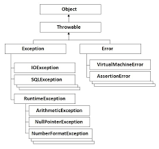

# Exceptions



```
    try {

    }
    catch (Throwable){

    }
    finally {

    }
```

## Runtime Exceptions
https://docs.oracle.com/javase/7/docs/api/java/lang/RuntimeException.html

## Multiple Catch blocks

## Custom Exceptions